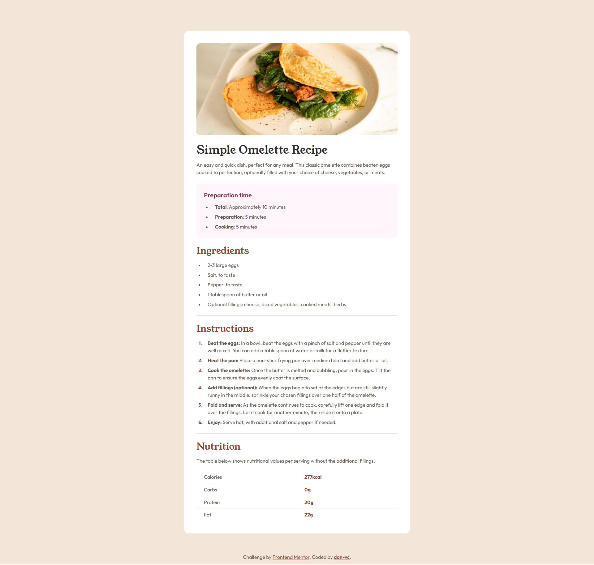

# Frontend Mentor - Recipe page solution

This is a solution to the [Recipe page challenge on Frontend Mentor](https://www.frontendmentor.io/challenges/recipe-page-KiTsR8QQKm). Frontend Mentor challenges help you improve your coding skills by building realistic projects. 

## Table of contents

- [Overview](#overview)
  - [Screenshot](#screenshot)
  - [Links](#links)
- [My process](#my-process)
  - [Built with](#built-with)
- [Author](#author)

## Overview

### Screenshot

### Links

- Solution URL: [Add solution URL here](https://www.frontendmentor.io/solutions/recipe-page-solution-using-html-markup-and-tailwind-css-ObOWgsda_Q)
- Live Site URL: [Add live site URL here](https://dan-vc.github.io/frontendmentor-recipe-page/)

## My process

### Built with

- Semantic HTML5 markup
- CSS custom properties
- Flexbox
- [Tailwind](https://tailwindcss.com/) - CSS Framework

## Author

- Website - [Daniel Villafranqui](https://portafolio-danvc.netlify.app/)
- Frontend Mentor - [@dan-vc](https://www.frontendmentor.io/profile/dan-vc)